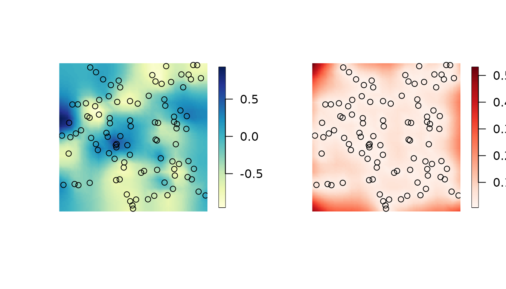
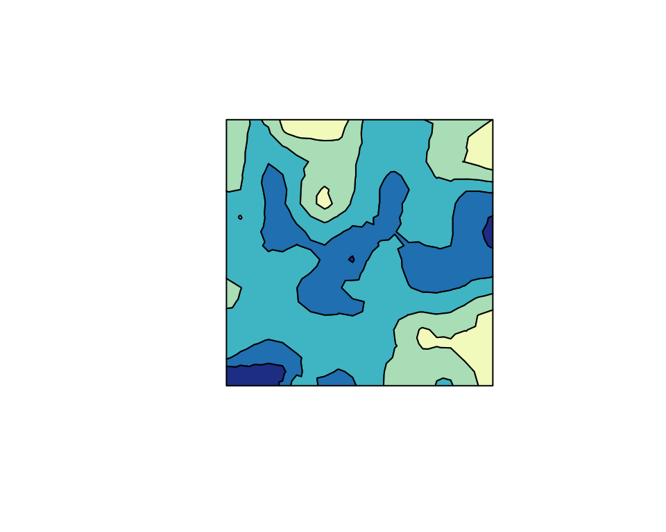
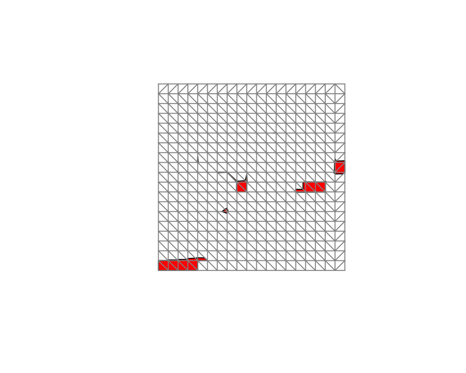
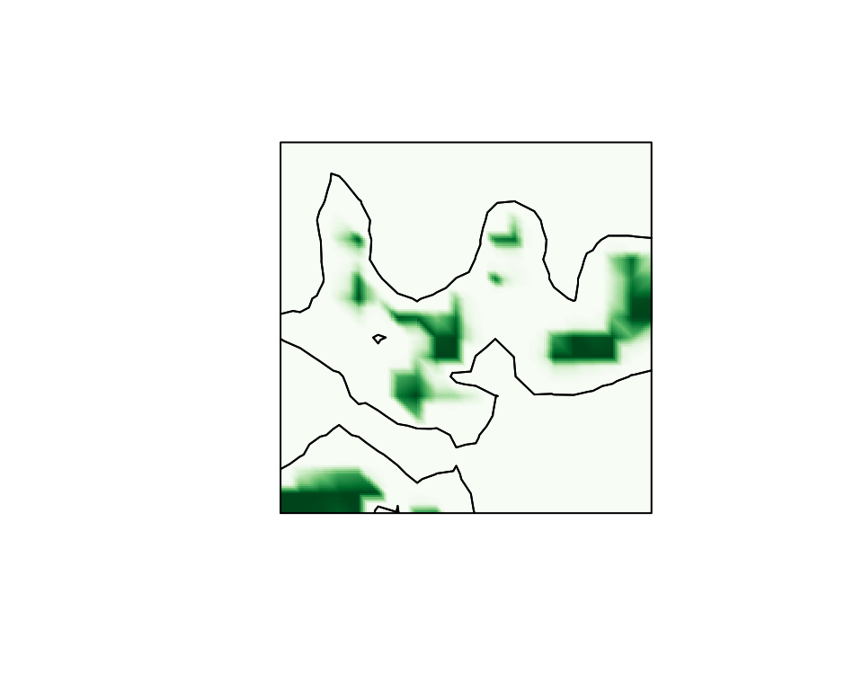

# Calculating probabilistic excursion sets and related quantities using excursions

The functions in `excursions` can be divided into four main categories
depending on what they compute: (1) Excursion sets and credible regions
for contour curves, (2) Quality measures for contour maps, (3)
Simultaneous confidence bands, and (4) Utility such as Gaussian
integrals and continuous domain mappings. The main functions come in at
least three different versions taking different input: (1) The
parameters of a Gaussian process, (2) results from an analysis using the
`INLA` software package, and (3) Monte Carlo simulations of the process.
These different categories are described in further detail below.

As an example that will be used to illustrate the methods in later
sections, we generate data
$Y_{i} \sim N\left( X\left( s_{i} \right),\sigma^{2} \right)$ at some
locations $s_{1},\ldots,s_{100}$ where $X(s)$ is a Gaussian random field
specified using a stationary SPDE model (Finn Lindgren, Rue, and
Lindström 2011).

``` r
x <- seq(from = 0, to = 10, length.out = 20)
mesh <- fm_rcdt_2d_inla(
  lattice = fm_lattice_2d(x = x, y = x),
  extend = FALSE, refine = FALSE
)
Q <- fm_matern_precision(mesh, alpha = 2, rho = 3, sigma = 1)
x <- fm_sample(n = 1, Q = Q)
obs.loc <- 10 * cbind(runif(100), runif(100))
```

Based on the observations, we calculate the posterior distribution of
the latent field, which is Gaussian with mean `mu.post` and precision
matrix `Q.post`, these are computed as follows. We refer to (F. Lindgren
and Rue 2015) for details about the `INLA` related details in the code.

``` r
A <- fm_basis(mesh, loc = obs.loc)
sigma2.e <- 0.01
Y <- as.vector(A %*% x + rnorm(100) * sqrt(sigma2.e))
Q.post <- (Q + (t(A) %*% A) / sigma2.e)
mu.post <- as.vector(solve(Q.post, (t(A) %*% Y) / sigma2.e))
```

The following figures show the posterior mean and the posterior standard
deviations.

``` r
proj <- fm_evaluator(mesh, dims = c(100, 100))
cmap <- colorRampPalette(brewer.pal(9, "YlGnBu"))(100)

sd.post <- excursions.variances(Q = Q.post, max.threads = 2)^0.5
cmap.sd <- colorRampPalette(brewer.pal(9, "Reds"))(100)

par(mfrow = c(1, 2))
image.plot(proj$x, proj$y, fm_evaluate(proj, field = mu.post),
  col = cmap, axes = FALSE,
  xlab = "", ylab = "", asp = 1
)
points(obs.loc[, 1], obs.loc[, 2], pch = 20)
image.plot(proj$x, proj$y, fm_evaluate(proj, field = sd.post),
  col = cmap.sd, axes = FALSE,
  xlab = "", ylab = "", asp = 1
)
points(obs.loc[, 1], obs.loc[, 2], pch = 20)
```



## Excursion sets and contour credible regions

The main function for computing excursion sets and contour credible
regions is `excursions`. A typical call to the function looks like

``` r
res.exc <- excursions(
  mu = mu.post, Q = Q.post, alpha = 0.1, type = ">",
  u = 0, F.limit = 1
)
```

Here, `mu` and `Q` are the mean vector and precision matrix for the
joint distribution of the Gaussian vector `x`. The arguments `alpha`,
`u`, and `type` are used to specify what type of excursion set that
should be computed: `alpha` is the error probability, `u` is the
excursion or contour level, and `type` determines what type of region
that is considered: ‘\>’ for positive excursion regions, ‘\<’ for
negative excursion regions, ‘!=’ for contour avoiding regions, and ‘=’
for contour credibility regions. Thus, the call above computes the
excursion set $E_{0,0.1}^{+}$ as introduced in [Definitions and
computational
methodology](https://davidbolin.github.io/excursions/articles/theory.md).

The argument `F.limit` is used to specify when to stop the computation
of the excursion function. In this case with `F.limit=1`, all values of
$F_{u}^{+}$ are computed, but the computation time can be reduced by
decreasing the value of `F.limit`.

The function has the EB method as default strategy for handling the
possible latent Gaussian structure. In the simulated example, the
likelihood is Gaussian and the parameters are assumed to be known, so
the EB method is exact. The QC method can be used instead by specifying
`method='QC'`. In this case, the argument `rho` should be used to also
provide a vector with point-wise marginal probabilities:
$P\left( x_{i} > u \right)$ for positive excursions and contour regions,
and $P\left( x_{i} < u \right)$ for negative excursions. In the
situation when $\pi\left( x|Y,\theta \right)$ is Gaussian but
$\pi\left( x|Y \right)$ is not, the marginal probabilities should be
calculated under the distribution $\pi\left( x|Y \right)$ and `mu` and
`Q` should be chosen as the mean and precision for the distribution
$\pi\left( x|Y,\widehat{\theta} \right)$ where $\widehat{\theta}$ is the
MAP or ML estimate of the parameters.

The function has a version `excursions.inla` used to analyze outputs of
`INLA`, which is described further in the [`INLA`
interface](https://davidbolin.github.io/excursions/articles/inla.html)
vignette.

The function `excursions.mc` can be used to post-process Monte Carlo
model simulations in order to compute excursion sets and credible
regions. For this function, the model is not specified explicitly.
Instead a $d \times N$ matrix `X` containing $N$ Monte Carlo simulations
of the $d$ dimensional process of interest is provided. A basic call to
the function looks like

``` r
excursions.mc(X, u, type)
```

where `u` again determines the level of interest and `type` defines the
type of set that should be computed. It is important to note that this
function does all computations purely based on the Monte Carlo samples
that are provided, and it does not use any of the computational methods
based on sequential importance sampling for Gaussian integrals that the
is the basis for the previous methods. This means that this function in
one sense is more general as `X` can be samples from any model, not
necessarily a latent Gaussian model. The price that has to be payed for
this generality is that the only way of increasing the accuracy of the
results is to increase the number of Monte Carlo samples that are
provided to the function.

## Analysis of contour maps

The main function for analysis of contour maps is `contourmap`. A basic
call to the function looks like

``` r
res.con <- contourmap(
  mu = mu.post, Q = Q.post,
  n.levels = 4, alpha = 0.1,
  compute = list(F = TRUE, measures = c("P0"))
)
```

Here, `mu` is again the mean value and `Q` is the precision matrix of
the model. The parameter `n.levels` sets the number of contours that
should be used in the contour map, and these are spaced equidistant in
the range of `mu` by default. Other types of contour maps can be
obtained using the `type` argument. For manual specification of the
levels, the `levels` argument can be used instead. By default, the
function computes the specified contour map but no quality measures and
it does not compute the contour map function. If quality measures should
be computed, this is specified using the `compute` argument. This
argument is also used to decide whether the contour map function $F$
should be computed.

As for `excursions`, this function comes in two other versions depending
on the form of the input: `contourmap.inla` for model specification
using an `INLA` object, or `contourmap.mc` for model specification using
Monte Carlo simulations of the model. The model specification using
these functions is identical to that in the corresponding `excursions`
functions. See the [`INLA`
interface](https://davidbolin.github.io/excursions/articles/inla.html)
vignette for examples using `contourmap.inla`.

## Continuous domain interpretations

A common scenario is that the input used in `contourmap` or `excursions`
represents the value of the model at some discrete locations in a
continuous domain of interest. In this case, the function `continuous`
can be used to interpolate the discretely computed values by assuming
monotonicity of the random field in between the discrete computation
locations, as discussed in [Definitions and computational
methodology](https://davidbolin.github.io/excursions/articles/theory.md).
A typical calls to the function looks like

``` r
sets.exc <- continuous(ex = res.exc, geometry = mesh, alpha = 0.1)
```

Here `ex` is the result of the call to `contourmap` or `excursions` and
`alpha` is the error probability of interest for the excursion set or
credible region computation. The argument `geometry` specifies the
geometric configuration of the values in input `ex`, either as a general
triangulation geometry or as a lattice. A lattice can be specified as an
object of the form `list(x, y)` where `x` and `y` are vectors, or as
`list(loc, dims)` where `loc` is a two-column matrix of coordinates, and
is the lattice size vector. If `INLA` is used, the lattice can also be
specified as an `fm_lattice_2d` object. In all cases, the input is
treated topologically as a lattice with lattice boxes that are assumed
convex. A triangulation geometry is specified as an `fm_mesh_2d` object.
Finally, an argument `output` can be used to specify what type of object
should be generated. The options are currently `sp` which gives a
`SpatialPolygons` object, and `inla` which gives an `fm_segm` object.

## Simultaneous confidence bands

The function `simconf` can be used for calculating simultaneous
confidence bands for a Gaussian process $X(s)$. A basic call to the
function looks like

``` r
simconf(alpha, mu, Q)
```

where `alpha` is the coverage probability, `mu` is the mean value vector
for the process, and `Q` is the precision matrix for the process. The
function has a few optional arguments similar to those of `excursions`,
all listed in the documentation of the function. The function returns
upper and lower limits for both pointwise and simultaneous confidence
bands.

As for `excursions` and `contourmap`, there is also a version of
`simconf` that can be used to analyze `INLA` models (`simconf.inla`) and
a version that can analyze Monte Carlo samples (`simconf.mc`).
Furthermore, there is a version `simconf.mixture` which is used to
compute simultaneous confidence regions for Gaussian mixture models with
a joint distribution on the form
$$\pi(x) = \sum\limits_{k = 1}^{K}w_{k}N\left( \mu_{k},Q_{k}^{- 1} \right).$$
This particular function was used to analyze the models in (Bolin et al.
2015) and (Guttorp et al. 2014), but is also used internally by
`simconf.inla`.

## Gaussian integrals

Among the utility functions in the package, the function `gaussint` can
be especially useful also in a larger context. It contains the
implementation of the sequential importance sampling method for
computing Gaussian integrals, described in [Definitions and
computational
methodology](https://davidbolin.github.io/excursions/articles/theory.md).
This function has two features that separates it from many other
functions for computing Gaussian integrals: Firstly it is based on the
precision matrix of the Gaussian distribution, and sparsity of this
matrix can be utilized to decrease computation time. Secondly, the
integration can be stopped as soon as the value of the integral in the
sequential integration goes below some given value $1 - \alpha$. If one
only is interested in the exact value of the integral given that it is
larger than some value $1 - \alpha$, this option can save a lot of
computation time.

A basic call to the function looks like

``` r
gaussint(mu, Q, a, b)
```

where `mu` is the mean value vector, `Q` is the precision matrix, `a` is
a vector of the lower limits in the integral, and `b` contains the upper
integration limits. If the Cholesky factor of `Q` is known beforehand,
this can be supplied to the function using the `Q.chol` argument. An
argument `alpha` is used to set the computational $1 - \alpha$ limit for
the integral. The function returns an estimate of the integral as well
as an error estimate. If the error estimate is too high, the precision
can be increased by increasing the `n.iter` argument of the function.

## Plotting

The `excursions` package contains various functions that are useful for
visualization. The function `tricontourmap` can be used for
visualization of contour maps computed on triangulated meshes. The
following code plots the posterior mean using the contour map we
previously computed.

``` r
set.sc <- tricontourmap(mesh,
  z = mu.post,
  levels = res.con$u
)
plot(set.sc$map, col = contourmap.colors(res.con, col = cmap))
```



Here `contourmap.colors` is used to find appropriate colors for each set
in the contour map, based on the color map `cmap` that was defined using
the `RColorBrewer` package. The estimated excursion set can be
visualized as

``` r
plot(sets.exc$M["1"],
  col = "red",
  xlim = range(mesh$loc[, 1]),
  ylim = range(mesh$loc[, 2])
)
plot(mesh,
  vertex.color = rgb(0.5, 0.5, 0.5),
  draw.segments = FALSE,
  edge.color = rgb(0.5, 0.5, 0.5),
  add = TRUE
)
```



The second `plot` command adds the mesh to the plot so that we can see
how the set is interpolated by the `continuous` function. Finally, the
interpolated excursion function $F_{u}^{+}(s)$, can be plotted easily
using the `fm_evaluator` function from the `INLA` package.

``` r
cmap.F <- colorRampPalette(brewer.pal(9, "Greens"))(100)
proj <- fm_evaluator(sets.exc$F.geometry, dims = c(200, 200))
image(proj$x, proj$y, fm_evaluate(proj, field = sets.exc$F),
  col = cmap.F, axes = FALSE, xlab = "", ylab = "", asp = 1
)
con <- tricontourmap(mesh, z = mu.post, levels = 0)
plot(con$map, add = TRUE)
```



The final two lines computes the level zero contour curve and plots it
in the same figure as the interpolated excursion function.

## References

Bolin, David, Peter Guttorp, Alex Januzzi, Daniel Jones, Marie Novak,
Harry Podschwit, Lee Richardson, Aila Särkkä, Colin Sowder, and Aaron
Zimmerman. 2015. “Statistical Prediction of Global Sea Level from Global
Temperature.” *Statistica Sinica* 25: 351–67.
<https://doi.org/10.5705/ss.2013.222w>.

Guttorp, Peter, Alex Januzzi, Marie Novak, Harry Podschwit, Lee
Richardson, Colin D Sowder, Aaron Zimmerman, David Bolin, and Aila
Särkkä. 2014. “Assessing the Uncertainty in Projecting Local Mean Sea
Level from Global Temperature.” *Journal of Applied Meteorology and
Climatology* 53 (9): 2163–70.
<https://doi.org/10.1175/jamc-d-13-0308.1>.

Lindgren, Finn, Håvard Rue, and Johan Lindström. 2011. “An Explicit Link
Between Gaussian Fields and Gaussian Markov Random Fields: The
Stochastic Partial Differential Equation Approach (with Discussion).”
*Journal of the Royal Statistical Society B* 73: 423–98.
<https://doi.org/10.1111/j.1467-9868.2011.00777.x>.

Lindgren, F., and H. Rue. 2015. “Bayesian Spatial and Spatiotemporal
Modelling with .” *Journal of Statistical Software* 63 (19).
<https://doi.org/10.18637/jss.v063.i19>.
