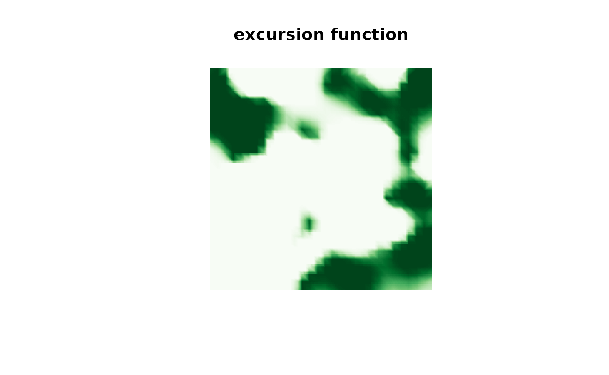
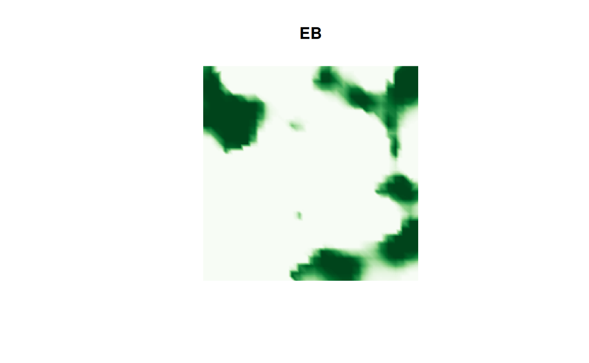
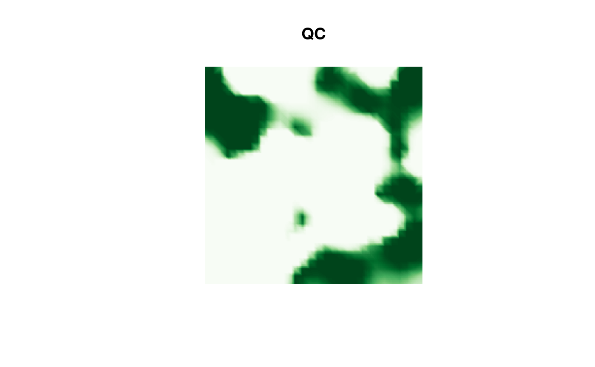
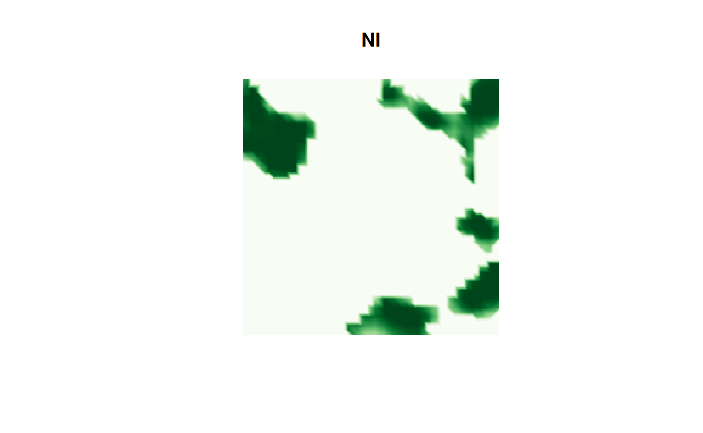
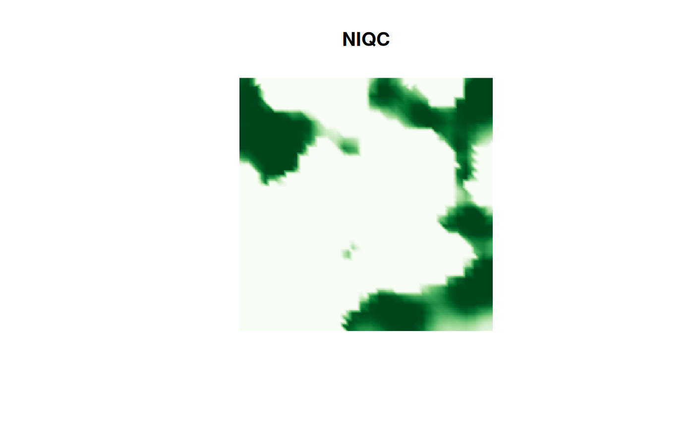

# inlabru interface

## Introduction

The `excursions` package can also be used to analyze results obtained
using `inlabru`. An advantage with `inlabru` is that it usually
simplifies the model specification compared with plain `INLA`. To
analyze `inlabru` outputs, the functions `excursions.inla`,
`simconf.inla` and `contourmap.inla` can be used. Let us illustrate this
using simulated data.

Let us generate some data

``` r
n.lattice <- 30
x <- seq(from = 0, to = 10, length.out = n.lattice)
lattice <- fm_lattice_2d(x = x, y = x)
mesh <- fm_rcdt_2d_inla(lattice = lattice, extend = FALSE, refine = FALSE)

sigma2.e <- 0.1
n.obs <- 100
obs.loc <- cbind(
  runif(n.obs) * diff(range(x)) + min(x),
  runif(n.obs) * diff(range(x)) + min(x)
)
Q <- fm_matern_precision(mesh, alpha = 2, rho = 3, sigma = 1)
x <- fm_sample(n = 1, Q = Q)
A <- fm_basis(mesh, loc = obs.loc)
Y <- as.vector(A %*% x + rnorm(n.obs) * sqrt(sigma2.e))
```

We now fit the model using `rSPDE` and `inlabru`. If we want to obtain
an excursion set of the linear predictor evaluated at the mesh, the
simplest option is to define a likelihood component in the `bru` call
which contains `NA` observations at the mesh locations. We then give
this component a tag (`pred` below) so that we can access these later.

``` r
rspde_model <- rspde.matern(mesh = mesh, nu = 1.5)
data <- data.frame(x1 = obs.loc[, 1], x2 = obs.loc[, 2], y = Y)
coordinates(data) <- c("x1", "x2")

# data for prediction locations
data.prd <- data.frame(
  x1 = mesh$loc[, 1],
  x2 = mesh$loc[, 2],
  y = rep(NA, dim(mesh$loc)[1])
)
coordinates(data.prd) <- c("x1", "x2")

cmp <- y ~ Intercept(1) + field(coordinates, model = rspde_model)
result_bru <- bru(~ Intercept(1) + field(coordinates, model = rspde_model),
  like(y ~ ., family = "normal", data = data),
  like(y ~ ., family = "normal", data = data.prd, tag = "prd"),
  options = list(
    control.compute = list(return.marginals.predictor = TRUE),
    num.threads = "1:1"
  )
)
#> Warning: `like()` was deprecated in inlabru 2.12.0.
#> ℹ Please use `bru_obs()` instead.
#> This warning is displayed once every 8 hours.
#> Call `lifecycle::last_lifecycle_warnings()` to see where this warning was
#> generated.
#> Warning: The `data` argument of `bru_obs()` has deprecated support for `Spatial` input
#> as of inlabru 2.12.0.9023.
#> ℹ Please use `sf` input instead.
#> ℹ The deprecated feature was likely used in the inlabru package.
#>   Please report the issue at <https://github.com/inlabru-org/inlabru/issues>.
#> This warning is displayed once every 8 hours.
#> Call `lifecycle::last_lifecycle_warnings()` to see where this warning was
#> generated.
```

We can now compute excursion sets using the `excursions.inla` function.
As no stack object is constructed when using `inlabru`, we use the
argument `name = "APredictor"` to tell the function that we are
interested in the linear predictor. We then use the `bru_index` function
to obtain the indices for the relevant part of the predictor. In this
case, we want the indices which correspond to the likelihood component
which we gave the tag `"pred"` above, so the call looks as follows.

``` r
res.qc_bru <- excursions.inla(result_bru,
  name = "APredictor",
  ind = bru_index(result_bru, "prd"),
  alpha = 0.99, u = 0,
  method = "QC", type = ">",
  prune.ind = TRUE,
  max.threads = 2
)
```

Note that we here set `prune.ind = TRUE` which tells the function that
we want the result object only evaluated at the indices specified by the
`ind` argument. We can now obtain a continuous domain representation
through the `continuous` function

``` r
sets <- continuous(res.qc_bru, mesh, alpha = 0.1)
```

Finally, we can plot the results

``` r
cmap.F <- colorRampPalette(brewer.pal(9, "Greens"))(100)
proj <- fm_evaluator(sets$F.geometry, dims = c(300, 200))
image(proj$x, proj$y, fm_evaluate(proj, field = sets$F),
  col = cmap.F, axes = FALSE, xlab = "", ylab = "", asp = 1,
  main = "excursion function"
)
```



## comparison of the different types of approximations

Above we used the `QC` method to compute the set. Let us now try the
other available options and compare their timings and results.

``` r
t.EB <- system.time(
  res.EB <- excursions.inla(result_bru,
    name = "APredictor",
    ind = bru_index(result_bru, "prd"),
    alpha = 0.99, u = 0,
    method = "EB", type = ">",
    prune.ind = TRUE,
    max.threads = 2
  )
)
t.QC <- system.time(
  res.QC <- excursions.inla(result_bru,
    name = "APredictor",
    ind = bru_index(result_bru, "prd"),
    alpha = 0.99, u = 0,
    method = "QC", type = ">",
    prune.ind = TRUE,
    max.threads = 2
  )
)
t.NI <- system.time(
  res.NI <- excursions.inla(result_bru,
    name = "APredictor",
    ind = bru_index(result_bru, "prd"),
    alpha = 0.99, u = 0,
    method = "NI", type = ">",
    prune.ind = TRUE,
    max.threads = 2
  )
)
t.NIQC <- system.time(
  res.NIQC <- excursions.inla(result_bru,
    name = "APredictor",
    ind = bru_index(result_bru, "prd"),
    alpha = 0.99, u = 0,
    method = "NIQC", type = ">",
    prune.ind = TRUE,
    max.threads = 2
  )
)
```

The computation time for the different methods are

``` r
print(data.frame(
  time = c(t.EB[3], t.QC[3], t.NI[3], t.NIQC[3]),
  row.names = c("EB", "QC", "NI", "NIQC")
))
#>        time
#> EB    3.900
#> QC    4.042
#> NI   39.042
#> NIQC 43.067
```

We can see that the `EB` and `QC` methods have similar computation times
and that `NI` and `NIQC` take longer. Let us now plot the corresponding
sets, we start with the `EB` result:

``` r
image(proj$x, proj$y, fm_evaluate(proj,
  field = continuous(res.EB,
    mesh,
    alpha = 0.1
  )$F
),
col = cmap.F, axes = FALSE, xlab = "", ylab = "", asp = 1,
main = "EB"
)
```



Then the `QC` result:

``` r
image(proj$x, proj$y, fm_evaluate(proj,
  field = continuous(res.QC,
    mesh,
    alpha = 0.1
  )$F
),
col = cmap.F, axes = FALSE, xlab = "", ylab = "", asp = 1,
main = "QC"
)
```



Then the `NI` result:

``` r
image(proj$x, proj$y, fm_evaluate(proj,
  field = continuous(res.NI,
    mesh,
    alpha = 0.1
  )$F
),
col = cmap.F, axes = FALSE, xlab = "", ylab = "", asp = 1,
main = "NI"
)
```



and finally the `NIQC` result:

``` r
image(proj$x, proj$y, fm_evaluate(proj,
  field = continuous(res.NIQC,
    mesh,
    alpha = 0.1
  )$F
),
col = cmap.F, axes = FALSE, xlab = "", ylab = "", asp = 1,
main = "NIQC"
)
```


